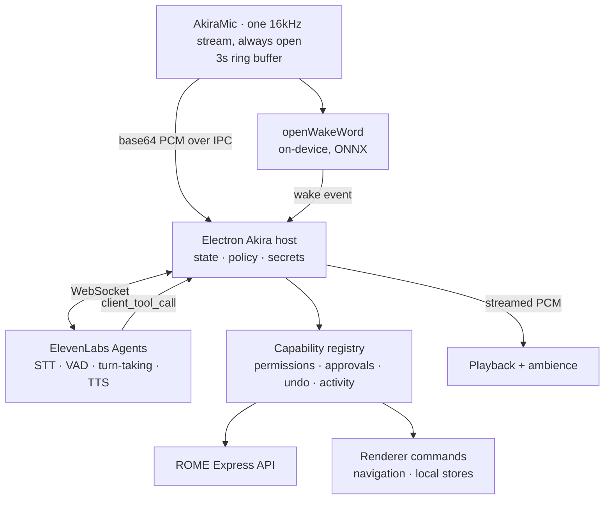

# Akira V3 architecture

Akira is ROME's voice and action layer. You say its name, it answers, and it
operates the application on your behalf. It has no persistent interface: when
dormant, ROME looks exactly like ROME.

Three parties, with a deliberate split of trust:

- **ElevenLabs Agents** runs the live conversation — speech recognition, voice
  activity detection, turn-taking, interruption, and speech synthesis.
- **The Electron main process** owns credentials, permission policy, and the
  capability registry that actually performs work.
- **The renderer** owns the microphone, the wake word, and the ambience.

## Why it is shaped this way

**V2's conversation was serial and could not be made smooth.** It recorded a
whole utterance, waited out ~950ms of silence, batch-transcribed it, ran a model
to completion, and only then requested speech. Nothing overlapped, so
time-to-first-audio was 6–15 seconds. V3 replaces that with one WebSocket
carrying audio in both directions continuously. Turn-taking is the server's job,
which is what makes a pause feel like a pause rather than the end of a turn.

**V2's wake word fought itself over the microphone.** A separate process held
the device while dormant; on detection it released, and the renderer cold-started
`getUserMedia` and began recording 30ms later. On macOS that acquisition costs
hundreds of milliseconds, so the start of every request was lost, along with
anything said after "Akira" in the same breath. V3 opens one stream, once, and
never closes it. Wake detection and conversation are two consumers of the same
frames.

**Hermes is gone from the live path.** It remains in the tree and can still be
installed, but nothing in a conversation depends on it. In V2 every entry point
awaited its readiness, so an uninstalled Python runtime made all of Akira
unusable — which is exactly what happened in practice.

## Microphone

`client/src/akira/AkiraMic.ts` holds a single `getUserMedia` stream for the
lifetime of the window. An `AudioWorklet` resamples to 16 kHz mono Int16 using
the context's real sample rate, carrying the fractional cursor across frames so
there is no click at buffer boundaries.

A three-second ring buffer is always filled. When a conversation starts, its
recent contents are flushed upstream as pre-roll — that is what makes "Akira,
open my idea workshop" work as one sentence instead of two.

Audio leaves the machine only while streaming is explicitly enabled. Dormant
capture stays in process, in a fixed-size buffer, and is never written to disk.

## Wake word

`client/src/akira/wake/OpenWakeWord.ts` runs three ONNX models through
`onnxruntime-web`: a melspectrogram transform, a frozen Google speech-embedding
model, and a small classifier trained for "Akira". Only the classifier is
specific to the wake word, so changing wake words means replacing one file.

Models live in `client/public/akira/`. Audio is fed as **int16 magnitudes cast
to float32, not normalised to ±1** — normalising yields a spectrogram that looks
like silence and the model never fires.

Detection is optional throughout. A missing package, missing models, or a
disabled setting simply leaves it off; `Command+'` still works.

## Conversation

`electron/akira/realtime-session.ts` owns the socket. It mints a signed URL when
an API key is present and falls back to a direct connection for public agents.
Audio is base64 PCM at 16 kHz in both directions.

Overrides are attempted, then dropped on rejection. ElevenLabs requires each
overridable field to be enabled under the agent's Security tab and rejects the
whole connection when one is not — surfacing as a socket that opens and then
closes with code 1008 and no error frame. On that specific failure the
connection retries without overrides, so a misconfigured agent still talks and
the user is told which switch to flip.

States: `DORMANT`, `LISTENING`, `PROCESSING`, `SPEAKING`, `ACTING`,
`AWAITING_APPROVAL`, `ERROR`, `UNAVAILABLE`. Silence never ends a conversation —
only `Command+'`, a spoken standby command, the idle timeout, or a hard failure.

The idle timeout exists because conversations bill per minute and the wake word
has a real false-positive rate. Without it, one spurious trigger overnight runs
the meter until morning. Any genuine activity rearms it, and it never fires
mid-turn.

## Actions

The agent gets exactly **one** client tool, `rome_execute`, taking a capability
name and a JSON argument string. The catalogue of what it can execute is
injected into the system prompt at conversation start.

This is deliberate. ElevenLabs client tools must be pre-registered on the agent
and cannot be supplied per conversation, and their tools API is mid-migration
from inline definitions to a registry with workflow nodes. Syncing sixty tool
definitions against that would mean either a lot of manual dashboard work or
code written against a moving target. The prompt *is* overridable per
conversation, so the catalogue rides there instead — and adding a capability
needs no dashboard change at all.

The trade-off is real: the model sees a text catalogue rather than typed
schemas, so argument fidelity depends on how clearly the catalogue reads.
`validateCapabilityArguments` is the backstop, and its errors are written to be
legible to a model that needs to retry.

Every call lands in `capability-registry.ts`, so permission policy, approval
prompts, undo recording, activity logging, and React Query invalidation apply
exactly as they did when Hermes was the one deciding.

## Permissions and undo

Each capability declares `risk`, `visual`, the query keys and local stores it
invalidates, and whether it supports undo. Reads run silently. Writes ask unless
overridden. Destructive and financial actions **always** ask — a user `allow`
cannot suppress them.

Ambiguous targets return their candidates to the agent rather than failing, so
Akira can ask "the research board or the component board?" instead of reporting
that more than one matched.

Reversible mutations record a compensating action; `rome.undo` replays it
through the same boundary.

## Memory and context

Durable memory is ROME's existing `memory_items`, not a private store. Items
typed `preference`, `goal`, `insight`, `strength`, or `weakness` are compiled
into the prompt at conversation start, ordered by importance.

This is a deliberate constraint: everything Akira knows about you is a page you
can open and edit. An assistant that remembers things you cannot see or correct
is a liability, and a parallel hidden store would have created exactly that.

Navigation is reported as `contextual_update`, which folds into the conversation
without taking a turn — so Akira can resolve "that board I was just looking at"
without anyone naming it.

## Presence

`AkiraAmbience` is the only always-mounted surface. Dormant it renders nothing.
Active, the window edges bloom with a gradient tinted by state and breathing
with microphone level — driven through a CSS custom property rather than React
state, since the alternative is a re-render per audio frame.

It sits at `z-index: 210`: above the Constellation overlay, below the console
and the approval dialog. Gradient colours live in the Constellation layout
beside the ray and accent colours, because the renderer draws them.

When the World Browser mounts a native `WebContentsView`, a DOM overlay is
occluded, so the ambience switches to an inset frame drawn in the surrounding
margin.

Failures surface as a transient notice from the same layer. Removing the dock
removed the only place errors could appear, and a shortcut that fails silently
is indistinguishable from one that is not bound.

## Source map

| File | Responsibility |
|---|---|
| `shared/akira.ts` | Cross-process contracts, shortcut matching |
| `electron/akira/controller.ts` | Orchestration, state, prompt assembly, greeting |
| `electron/akira/realtime-session.ts` | ElevenLabs WebSocket |
| `electron/akira/tool-catalogue.ts` | Dispatch tool and prompt catalogue |
| `electron/akira/capability-registry.ts` | The capabilities themselves |
| `electron/akira/permission-policy.ts` | Risk evaluation, ambiguity |
| `electron/akira/greeting.ts` | Cached "Yes?" synthesis |
| `client/src/akira/AkiraMic.ts` | The microphone |
| `client/src/akira/wake/OpenWakeWord.ts` | Wake detection |
| `client/src/akira/AkiraProvider.tsx` | Playback, shortcuts, renderer commands, live context |
| `client/src/akira/AkiraAmbience.tsx` | The glow and transient notices |
| `client/src/akira/AkiraConsole.tsx` | Summoned console |
| `client/src/lib/trainingRecorder.ts` | Athena Trials results into training data |
