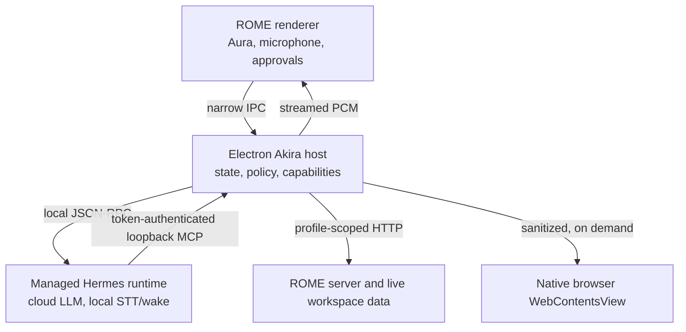

# Akira V2 architecture

Akira is ROME's desktop-native voice and action layer. ROME owns the interface, permissions, data access, activity history, and voice playback. A managed local Hermes process supplies agent reasoning and session continuity. ElevenLabs supplies low-latency speech synthesis when configured.

## Trust boundaries

The Hermes process is not given shell, file, code-execution, generic browser, computer-use, project, delegation, or desktop-control toolsets. Its only operational toolset is `mcp-rome`, generated from the host's typed capability registry. This is defense in depth: even a malformed model request reaches only a named ROME capability with validated arguments and host-side permission policy.

The MCP child connects back to Electron on a random loopback port with a 256-bit bearer token inherited through process environment. The token and provider credentials are never written into Hermes configuration or exposed to the renderer.

## Runtime lifecycle

Akira initializes asynchronously after the ROME window is created. A missing or unhealthy runtime puts Akira into `UNAVAILABLE` without delaying ROME startup. `HermesRuntimeManager` discovers an explicitly configured executable, Akira's managed `runtime/bin`, or `PATH`; it then runs `hermes serve` on an ephemeral loopback port and waits for `/health`.

Unexpected exits use bounded exponential restart: at most three restarts within five minutes. Replacing a runtime invalidates the previous process before the new health result can become authoritative. Runtime files, Whisper models, wake-word assets, sessions, settings, and logs live below the persistent `ROME/Akira` data directory rather than in the DMG/application bundle.

The generated Hermes profile uses:

- cloud model inference selected in Akira settings;
- local `faster-whisper` (`base` by default, `tiny` for lower memory);
- local Sherpa open-vocabulary detection for “Akira”;
- client-captured 16 kHz mono PCM while dormant;
- a ROME-specific `SOUL.md` and operator skill;
- only the dynamic `mcp-rome` toolset.

## Conversation and audio

The state machine is explicit: `DORMANT`, `WAKE_DETECTED`, `LISTENING`, `PROCESSING`, `SPEAKING`, `ACTING`, `AWAITING_APPROVAL`, `AWAKE_IDLE`, `DEACTIVATING`, `ERROR`, and `UNAVAILABLE`.

Hermes owns the local microphone while Akira is in standby and runs Sherpa wake detection entirely on-device. On detection, Hermes releases the device before the renderer opens its microphone stream for the spoken request. ROME reverses that handoff on standby so two capture systems never contend for the Mac's input device. Once active, VAD ends an utterance after configured silence, Hermes transcribes it locally, and only text plus a bounded live ROME snapshot goes to the chosen cloud model.

ElevenLabs WebSocket output uses `eleven_flash_v2_5` and `pcm_24000` by default. PCM chunks are scheduled into a low-latency Web Audio queue. Voice activity during `SPEAKING` cancels queued audio and interrupts the Hermes session (barge-in). After a response, Akira returns to `LISTENING`; silence does not end the conversation. Control+Escape explicitly returns to wake-word standby, including while a native `WebContentsView` has focus.

## Data authority and invalidation

Capabilities read the live ROME APIs or current renderer-owned stores at call time. The prompt receives a compact snapshot, not a second database. Browser page content is excluded unless the user enables it; reads strip scripts, forms, inputs, hidden content, and markup, cap the result, and label it as untrusted web content.

Every mutation declares React Query keys and renderer-local stores it affects. After success, Electron sends `rome:akira:data-changed`; the renderer invalidates matching queries and dispatches store refresh events. Task Stabilizer and Funding Dashboard listen for those events, preventing agent mutations from leaving stale UI state.

## Permissions, approvals, and undo

Each capability declares `risk`, visual behavior, invalidations, local stores, and undo support. Reads run in the background. Writes ask unless explicitly allowed. Destructive, financial, and bulk operations always require a visible one-time approval. Ambiguous names are rejected with candidates instead of selecting the first match.

Activity records are profile-aware and bounded. Reversible mutations record compensating actions with an expiry; `rome.undo` executes those through the same capability boundary. Secrets use Electron `safeStorage`; when platform encryption is unavailable Akira refuses to persist them and accepts process environment variables instead.

## Source map

- `shared/akira.ts` — cross-process contracts.
- `electron/akira/controller.ts` — orchestration and state.
- `electron/akira/runtime-manager.ts` — Hermes profile and lifecycle.
- `electron/akira/capability-registry.ts` — typed ROME capability surface.
- `electron/akira/host-bridge.ts` and `mcp-server.ts` — authenticated MCP boundary.
- `client/src/akira/AkiraProvider.tsx` — audio, renderer commands, invalidation.
- `client/src/akira/AkiraAura.tsx` — Aura, console, approvals, settings, memory, and diagnostics.
